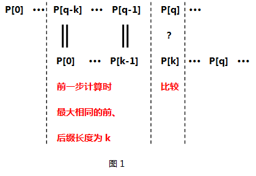
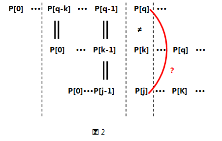

# Algorithms

-   [Algorithms](#algorithms)
    -   [Binary Search](#binary-search)
        -   [iteration](#iteration)
        -   [recursion](#recursion)
        -   [**LeetCode**](#leetcode)
    -   [Divide and Conquer](#divide-and-conquer)
        -   [**LeetCode**](#leetcode)
    -   [kth element and get median](#kth-element-and-get-median)
        -   [意义](#%E6%84%8F%E4%B9%89)
        -   [难点](#%E9%9A%BE%E7%82%B9)
        -   [**LeetCode**](#leetcode)
        -   [kth element (todo)](#kth-element-todo)
    -   [String (todo)](#string-todo)

## Binary Search

### iteration

```cpp
int BinarySearch(std::vector<int> &data, int target)
{
    // termiantor
    if (data.empty())
        return -1;//或者返回其他的

    int low = 0;
    int high = data.size() - 1;

    // important 1
    while (low <= high)
    {
        // important 2
        int mid = low + ((high - low) >> 1);

        if (data[mid] == target)
            return mid;
        else if (data[mid] < target)
            // important 1
            low = mid + 1;
        else
            // important 1
            high = mid - 1;
    }

    return -1;
}
```

-   terminator 返回什么一定要确认清楚
-   important 1 也可以写成如下形式，但是一定要对应起来，否则可能出现死循环

```cpp
    while(low < high)
    {
        ...
        low = mid;
        ...
        high = mid;
    }
```

-   important 2 求mid一定要注意
    如果用以下形式

```cpp
    int mid = (start + end)/2;
```

其中，start+end可能会溢出。而用以下形式又不够高效

```cpp
    int mid = start + (end - start)/2;
```

-   如果是浮点数，则比较时要用 abs(data[mid]-target)&lt;10^-5（小于一个指定的精度）
-   ★查找所有位置
    **上述二分查找代码在找到第一个目标时就会返回结果，但是如果数组中目标值有多个，如何返回它们的个数？** 上述代码中，有两个地方会返回
    > > while (low &lt;= high)

> > if (data[mid] == target)

如果在第二个判断条件不返回，而是记录之后继续查找，直到**low > high**时才返回，这样最后跳出循环时，**if(data[mid] == target)** 中的mid就是target最后一次出现的位置。
**这样子同时找到target第一次和最后一次位置的复杂度为O(log n)，而用线性遍历则是O(n)。**

### recursion

```cpp
int BinarySearch(std::vector<int> &data, int target)
{
    // termiantor
    if (data.empty())
        return -1;//或者返回其他的

    int low = 0;
    int high = data.size() - 1;

    return BinarySearchRecursion(data, target, low, high);
}

int BinarySearchRecursion(std::vector<int> &data, int target, int low, int high)
{
    // recursion terminator
    if (low > high)
        return -1;

    // current level processing
    int mid = low + ((high - low) >> 1);
    if (data[mid] == target)
        return mid;

    //drill down
    if (data[mid] < target)
        BinarySearchRecursion(data, target, mid + 1, high);
    else
        BinarySearchRecursion(data, target, low, mid - 1);
}
```
### C++实现
`lower_bound()`返回第一个大于等于val的位置  
`upper_bound()`返回第一个大于val的位置  
`binary_search()`是否存在val  


### **LeetCode**

-   50 Pow(x,n)
-   69 Sqrt(x)
-   4 Median of Two Sorted Arrays
-   230 Kth Smallest Element in a BST
-   300 Longest Increasing Subsequence


## Divide and Conquer

### **LeetCode**

-   23 Merge k Sorted Lists

* * *

## kth element and get median

### 意义

首先，取median可以看作是去kth element的特例，k=n/2取整。  
同时，median可以把原数据集划分成两个规模相仿的子集，**能够高效地确定中位数，将直接关系到采用分治策略的算法能否高效地实现，比如二分法。**

### 难点

对于有序的数组，可以通过下标来直接访问median，时间复杂度为O(1)。  
对于有序的链表，通过两个快慢指针来寻找median，时间复杂度为O(n)。此处也可能是一些排序的树形结构，比如红黑树，通过next方法遍历迭代器来获取median。  
对于无序的数据，如果先排序，再寻找median，那么时间复杂度为O(nlogn)，那么基于此的分治算法，时间复杂度不会低于：
T(n) = nlogn +2T(n/2) = O(n(logn)^2)
median的难度在于**避免全排序的前提下**，在O(nlogn)时间内找到median  

### **LeetCode**

-   4 Median of Two Sorted Arrays  
-   295 Find Median from Data Stream  
-   480	Sliding Window Median  

-   215 Kth Largest Element in an Array
-   230 Kth Smallest Element in a BST 

从295题可以看出，有以下几种求中值的方法：  
1. 每次整体排序，然后求中值，整体时间复杂度O(n^2logn)，单次为O(nlogn)，太高。  
2. 用BST来存储，在排好序的结构中，用中序遍历（或者迭代器）来求中值O(n)。这样每次只需要部分排序，但是get median时间复杂度为O(n)，整体时间复杂度会是O(nlogn)+O(n)，单次为O(logn)+O(n)。例如480的solution 1和230。  
3. 用两个heap或者priority queue，get median时间复杂度为O(1)，调整时间复杂度为O(logn)，只需要部分排序，整体时间复杂度O(nlogn)+O(1)，单次为O(logn)+O(1)。例如295中的solution 3和480中的solution 2。**虽然方法3和方法1的时间复杂度一样，但是方法1是全排序，在数据量大时是完全不能接受的，而堆的调整是部分排序。**  
4. 具体算法见295的solution 4。单次时间复杂度为O(logn)+O(1)。例如4的solution 3c和295的solution 4 [ref](https://leetcode.com/problems/find-median-from-data-stream/solution/)。  

* * *

### kth element
和median类似
1. sort，time:O(nlogn)
2. 用heap或者multiset来排序，最后可以用next算法取第k个元素，单次取kth和solution1效果差不多。
3. 用两个priority_queue，取median时两个堆的元素最多相差1，而取kth时保持大顶堆（存放小元素）大小为k，小顶堆大小为（n-k）。适合与k比较小的情况。
4. quick select（divide and conquer），不断构造privot A[i]，将lo和hi彼此靠拢，超找范围缩减至A[i]的某一侧，当i==k时，迭代停止。time:O(n^2)  (215题)


* * *

## String (todo)
字符串匹配 （字符串s是否包含目标串p）
1. brute force
当s[i]与p[0]匹配时，逐个匹配之后的字符，若有一个不匹配，那么从s[i+1]开始重新匹配

2. kmp
利用部分匹配表（next数组），当发现不匹配时，不是重新退回，而是利用已经匹配过的数据，提高效率。  
`移动位数 = 已匹配的字符数 - 对应的部分匹配值`

这样每次不匹配时，i就可以直接移动到下次应该计算匹配的地方。


* bread 真前缀
b br bre brea
* bread 真后缀
read ead ad d

**"部分匹配值"就是"前缀"和"后缀"的最长的共有元素的长度。** "部分匹配"的实质是，有时候，字符串头部和尾部会有重复。比如从s[i]开始匹配p[0]，但是到了s[i+k]不匹配p[k]了，但是s[i+k-x : i+k-1]匹配p[k-x : k-1]，也就是匹配p[0 : x]，这样下次直接从s[i+k]与p[x+1]开始匹配。


* "A"的前缀和后缀都为空集，共有元素的长度为0；  
* "AB"的前缀为[A]，后缀为[B]，共有元素的长度为0；
* "ABC"的前缀为[A, AB]，后缀为[BC, C]，共有元素的长度0；
* "ABCD"的前缀为[A, AB, ABC]，后缀为[BCD, CD, D]，共有元素的长度为0；
* "ABCDA"的前缀为[A, AB, ABC, ABCD]，后缀为[BCDA, CDA, DA, A]，共有元素为"A"，长度为1；
* "ABCDAB"的前缀为[A, AB, ABC, ABCD, ABCDA]，后缀为[BCDAB, CDAB, DAB, AB, B]，共有元素为"AB"，长度为2；
* "ABCDABD"的前缀为[A, AB, ABC, ABCD, ABCDA, ABCDAB]，后缀为[BCDABD, CDABD, DABD, ABD, BD, D]，共有元素的长度为0。

pattern的部分匹配表，即next数组。其意义在于，当s[i]和p[j]不匹配时，下一步将s[i]与p[next[j-1]]进行匹配，重复进行，直到next[j-1]=0。

```c
int kmp(const char T[],const char P[],int next[])
{
    int n,m;
    int i,q;
    n = strlen(T);
    m = strlen(P);
    makeNext(P,next);
    for (i = 0,q = 0; i < n; ++i)
    {
        while(q > 0 && P[q] != T[i])
            q = next[q-1];
        if (P[q] == T[i])
        {
            q++;
        }
        if (q == m)
        {
            printf("Pattern occurs with shift:%d\n",(i-m+1));
        }
    }    
}
```
### next数组
其中最重要的就是如何根据待匹配的`模版字符串`求出对应每一位的`最大相同前后缀`的长度。
```cpp
void makeNext(const char P[],int next[])
{
    int q,k;//q:模版字符串下标；k:最大前后缀长度
    int m = strlen(P);//模版字符串长度
    next[0] = 0;//模版字符串的第一个字符的最大前后缀长度为0
    for (q = 1,k = 0; q < m; ++q)//for循环，从第二个字符开始，依次计算每一个字符对应的next值
    {
        while(k > 0 && P[q] != P[k])//递归的求出P[0]···P[q]的最大的相同的前后缀长度k
            k = next[k-1];          //不理解没关系看下面的分析，这个while循环是整段代码的精髓所在，确实不好理解  
        if (P[q] == P[k])//如果相等，那么最大相同前后缀长度加1
        {
            k++;
        }
        next[q] = k;
    }
}
```

next[q] = k 表示P[q]之前的子串中，存在长度为k的相同前缀和后缀，即P[0]~P[k-1]与P[q-k]~P[q-1]依次相同。如果P[k] = P[q]，那么next[q+1] = k+1，此时表示P[q+1]之前的子串中，存在长度为k+1的相同前后缀。  


如果P[k] != P[q]，**那么说明next[q+1] 不会是 k+1**，也就是说P[q+1]之前的子串中，不会存在长度为k+1的相同前后缀。那么**我们就要去寻找长度更短的相同前后缀**，假设长度为j，此时`P[0]~P[j-1]`和`P[q-j]~P[q-1]`依次相同。  
  
接着我们比较P[q]和P[j]是否相同，如果相同，则next[q+1] = j+1；如果不同，则按照k = next[k-1]递归查找（该思想和kmp的思想以及next数组的定义一致）。  

647. Palindromic Substrings
