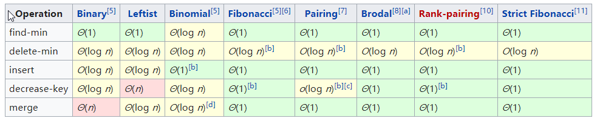
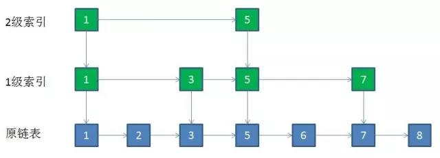
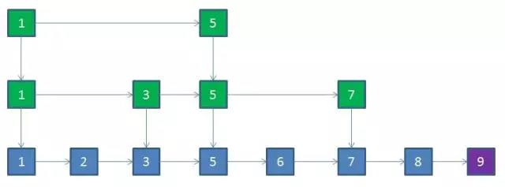
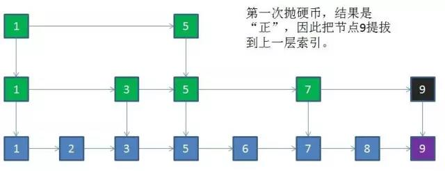
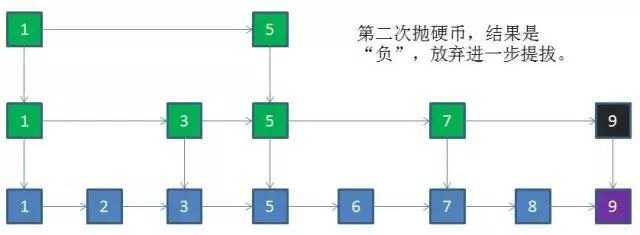
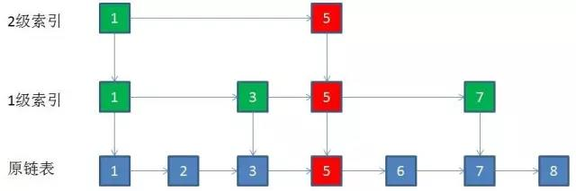
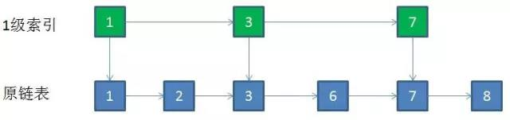

# Basic Data Structure Operations

- [Basic Data Structure Operations](#basic-data-structure-operations)
  - [vector](#vector)
    - [**LeetCode**](#leetcode)
  - [stack](#stack)
    - [**LeetCode**](#leetcode-1)
  - [linked-list](#linked-list)
    - [**LeetCode**](#leetcode-2)
  - [priority_queue](#priority_queue)
    - [**LeetCode**](#leetcode-3)
  - [skip list](#skip-list)
    - [Insert](#insert)
    - [Delete](#delete)
    - [Advantanges](#advantanges)
  - [Hash](#hash)
    - [radix sort](#radix-sort)
      - [**LeetCode**](#leetcode-4)
    - [Hash Tree](#hash-tree)
    - [Trie](#trie)
  - [Bitwise Operation](#bitwise-operation)
    - [**LeetCode**](#leetcode-5)
    - [Bloom Filter](#bloom-filter)


常用的数据结构一般有数组、单链表、栈、队列、树、哈希表、图等。这是按照数据结构的定义来划分的，一般关于数据结构的书上都是这么划分的。但是实际应用中，例如STL中封装的数据结构种类远不止这么多，而它们的底层实现却无外乎上述几种结构。这里按照STL中的结构将抽象数据结构分为stack、queue、set和map四种结构。

-   stack和queue都可以分别基于数组和链表实现。但实际应用中，stack常用于一些特殊模式的存储，和数组一样，按照先后顺序存储元素即可，对数据结构本身并没有太多操作，所以这里将其归为一类。
-   linked-list（**单链表**）在实际应用中主要用于那些插入删除频繁的数据结构，考察点也主要是单链表的基本操作。由于单链表不能随机访问，只能按照插入顺序逐个访问元素，这个过程就类似于队列的特性。此外链表还有 **双向链表** 和 **环形链表** ，但是在实际应用中最常用的还是单链表。**vector、linked-list、stack和queue都属于线性结构，应用中常用的线性结构还有双端队列deque。**
-   priority-queue能够按照特定的要求输出元素（按大小顺序等），其内部除了存储元素之外，还要维护一些额外的信息来实现该功能，一般由堆（也即树）或者其他更加复杂的结构来来实现。**所以priority-queue的内部其实是非线性结构，但是对使用者来说，可以像它的名字一样，把它看作是一个队列。**
-   set和map常用于查询某个数据是否存在，如果追求查询效率，则用哈希表来存储，查询时间复杂度为O(1)；而用红黑树来存储，查询复杂度为O(log n)，但是内部元素是排好序的，可以整体按序输出。

其实从内存的角度来看，所有的数据结构都可以归为链表，这里的链表并不等同于单链表。数据结构的形式变化再大，在内存中的每个结点无外乎要存储当前结点的值和后续结点的位置指针这两种元素。而每一种数据结构都可以看作是链表的一种特例，数组可以看作是以连续位置代替位置指针；后续指针为一个时就是单链表，为多个时就是树；后续指针又再次指向前序结点时就构成了图；而以数组和单链表为基础又可以根据不同功能来构建栈、队列与哈希表等结构。所以当你能够从一个计算机的角度来看待时，你就能够认识到这些数据结构都是统一的。

* * *

## vector

**41.first missing positive**

-   哈希表查找

*  solution 1  
该题的一般解法是先对数组进行排序，再从正整数部分开始遍历，查找到第一个不连续的值就可以。时间复杂度为O(nlogn)，主要是排序的时间复杂度。

*  solution 2  
第二种方法就根据题目的特性，数组中有n个元素，最理想的情况就是n个元素都是连续正整数，这样输出n，否则的话输出的数会小于n（考虑有负数和大的不连续的数的情况）。所以该方法首先将数组中的元素都存入哈希表，然后遍历数字1~n，查询当前数字是否在哈希表中，如不存在，则输出当前数；若都存在，则输出n。

**k sum**

-   两边夹逼
    时间复杂度最低为O(n^(k-1))
    空间复杂度最低为O(1)

* solution 1  
k层循环逐个数遍历 O(n^k)

*  solution 2  
1.  数组元素存入哈希表
2.  k-1层遍历，k-1个数加起来作为当前target
3.  从哈希表查询target是否存在

time: O(n^(k-1))  
space: O(n)

* solution3  

k>=3时 
1.  先sort数组 O(nlogn)
2.  k-2层循环枚举，k-2个数加起来作为当前target
3.  剩下n-k+1个元素两边夹逼，两个指针首尾遍历O(n)

time:O(n^(k-1))  
space:O(1)

**k=2时就退化为solution 2**  

### **LeetCode**
* 1.Two Sum
* 15.3Sum
* 18.4Sum
* 20.valid parentheses
* 120.Triangle

---
## stack
### **LeetCode**

---
## linked-list
### **LeetCode**
* 2.Add Two Numbers  
* 21.Merge Two Sorted Lists  

* * *

## priority_queue

[priority_queue](https://en.wikipedia.org/wiki/Priority_queue)可以有多种实现方式，内部结构不同，其操作的时间复杂度也不同。



最简单的方式就基于堆来实现。**这里的时间复杂度记最优的情况就可以。** 
优先队列有以下一些应用：

-   Bandwidth management
-   Discrete event simulation
-   Dijkstra's algorithm
-   Huffman coding
-   Best-first search algorithms ( like A\* )
-   Prim's algorithm for minimum spanning tree
-   ROAM triangulation algorithm

* * *

**239.sliding window maximum**

**480.sliding window median**

solution 1
基本方法：两层循环 O(n\*k)

solution 2
通用方法
1.  最外层循环 O(n)
2.  用priority queue来维护这个window，最优情况下存取复杂度都为O(1)，但是不是最优时可能会退化为O(log n)
3.  每次priority queue输出最大值即可

**此方法的通用性在于priority queue的强大，可以适用于各种情况。比如求最大值，最小值，或者中值，或者第k大的数，都可以用priority queue来实现**

solution 3 特殊方法
deque
1.  最外层循环 O(n)
2.  用deque来维护这个window，deque中存储元素下标，这里deque的大小不固定，不像priority queue一样固定为k

```cpp
← deque  →
[1  3  -1] -3  5  3  6  7
↑       ↑
front   back

//1.窗口移动时，弹出最左边元素（如果该元素仍在窗口有效范围内，则保留）
if(deque.front <= i-k)       deque.pop_front();
//2.从窗口右端开始逐个与当前数nums[i]比较，小于nums[i]的数都弹出队列
while(nums[deque.back] < nums[i])     deque.pop_back();
//3.nums[i]插入队列，这样可以保证deque中的数是按照从大到小排列
//每次遍历nums[i]时，队列中比它小的数都会被删除
//这样队首总是窗口内的最大值
deque.push_back(i);
//4.输出最大值
res.push_back(nums[deque.front()]);
```

time: O(n)

**变形：求窗口中的中值**
由于这里是求中值，所以不能够直接用dequeue来求解。这里就体现出使用priority_queue的强大。

solution 1
依然用priority_queue来维护窗口，每次吐出k/2个元素，就可以得到中值。或者用c++11中的next算法，可以直接得到priority_queue中的第k/2个元素。

```cpp
auto it = std::next(window.begin(), (k - 1) / 2);
```

对于vector这种类型，next的时间复杂度为O(1)，而这里的时间复杂度为O(k)。

solution 2
用一个大顶堆和一个小顶堆来实现求中值。窗口内小于中值的数，存入大顶堆中，大于中值的数，存入大顶堆中。
1. remove element，每次窗口移动时，窗口最左边的数从包含它的堆中去除。
2. add element，窗口最右端新的数插入堆中。如果该数大于minHeap（大于中值的数）的root，则插入minHeap；否则插入maxHeap。（一开始可以默认加入maxHeap）
3. adjust heap，调整minHeap与maxHeap，使它们的大小之差&lt;=1。大于1时就把堆顶元素吐给另一个堆
4. get median，取中值，只需要两个堆的root求平均，或者直接去元素多的那个堆的root即可。

这样求中值的时间复杂度为O(1)。

### **LeetCode**
* 23.Merge k Sorted Lists  
* 239.sliding window maximum  
* 480.sliding window median  
* 295.Find Median from Data Stream

---
## skip list

有些数据的存储是按照线性排列的，如数组和链表，**但是数组和链表插入效率不高**（这里的插入包括先查询到要插入的位置，二分法。数组查找O(logn)，插入后元素移动O(n)；链表查询O(n)，插入O(1)）。  

    优化：如何快速查找有序链表的某一节点？    

可以将链表中的关键节点逐层提取，形成**多层链表结构**，用二分法来查找（O(logn)）。提取的极限是同一层只有两个节点。  
          

###  Insert  
大量新节点插入原链表中后，需要提取一部分到到上层节点索引中去。这里采用**随机**的方法来判断新节点是否提拔。因为跳跃表的删除和添加节点是不可预测的，很难用一种方式保证跳跃表的索引时钟均匀。随机可以保证整体区域均匀。例如插入结点9：  

    
    
    

1.  新节点和各层索引节点逐一比较，确定原链表的插入位置。O(logN)  
2.  把索引插入到原链表。O(1)  
3.  利用抛硬币的随机方式，决定新节点是否提升为上一级索引。结果为“正”则提升并继续抛硬币，结果为“负”则停止。O(logN)  

总体上，跳跃表插入操作的时间复杂度是O(logN) ，而这种数据结构所占空间是2N，既空间复杂度是 O(N)。

### Delete
在索引层找到要删除的节点，然后逐层删除相同节点即可。若某一层只剩下一个结点，那么就可这一层去掉。   
    
   

### Advantanges

Skip list和BST的查找效率同为O(logn)，但是Skip list的优势在于保持结构的平衡成本比较低，完全靠“随机”算法。而BST需要复杂的rebalance算法。但是“不是任何场景都能接受 skiplist 的随机性”。  
Skip List由于底部是链表，所以可以像B+树那样，进行**范围查询**。  
redis中的sorted-set也是基于跳跃表。  

----
## Hash

哈希冲突解决方法：
1. 再散列法，冲突后再往后找。缺点是不能删除元素，表被填满时性能下降。
2. 链地址法
3. 再哈希法
4. 公共溢出区

桶排序，时间复杂度为O(N)，比O(logN)还快。（计数排序也是，但是计数排序常用数组或者bitmap）   
比较排序的复杂度为O(logN)

### radix sort

核心思想是把数归类而不是比较排序。  
普通做法：    
1.  构建一个足够大的二维数组，比如radix为10，那就是10_n（n个元素），每一行可以看作一个桶。  
2. 从最低位开始遍历，将当前位上的数作为hash值放入桶中。  
   *   第一次遍历为直接遍历n个数；
   *   之后的遍历为从桶0开始遍历其中的数，一直到桶9。  
3.  直到所有的数都放到桶0中。

优化：
二维数组的使用，在空间上效率不高，用两个辅助数组优化，一个是 count\[]，一个是 tmp\[]。

```cpp
int exp = 1;   // 1, 10, 100, 1000 ...
int radix = 10;// base 10 system

vector<int> tmp(nums.size());
vector<int> bucket(nums.begin(), nums.end());
/* LSD Radix Sort */
while (maxVal / exp > 0)
{
    // 1.clear count
    vector<int> count(radix, 0);
    // 2.统计每个桶里面有多少个数
    // 对于当前第i个桶，0-i个桶的数总和即为，i桶中最后一个数应该排在第几位（在比较第k位时）
    for (int i = 0; i < bucket.size(); i++)
        count[(bucket[i] / exp) % 10]++;
    for (int i = 1; i < count.size(); i++)
        count[i] += count[i - 1];
    // 3.从后往前处理nums，判断其在count中的值，即为他实际应该排在第几位
    for (int i = bucket.size() - 1; i >= 0; i--)
        tmp[--count[(bucket[i] / exp) % 10]] = bucket[i];
    for (int i = 0; i < bucket.size(); i++)
        bucket[i] = tmp[i];

    exp *= 10;
}
```
#### **LeetCode**
* 164.Maximum Gap


### Hash Tree


### Trie 
Hash Tree的变种，主要用于统计和排序大量的字符串。  
核心思想是用空间换取时间，利用字符串的公共前缀来降低查询时间开销。  

* 208 Implement Trie (Prefix Tree)
* 212 Word Search II


----
## Bitwise Operation

```c
// 将x最右边的n位清零
x&(~0<<n)

// 获取x的第n位的值（0还是1）
(x>>n)&1

// 获取x的第n位的幂值
x&(1<<(n-1))

// 仅将第n位置1
x|(1<<n)

// 仅将第n位置0
x&(~(1<<n))

// 将x最高位至第n位（含）清零
x&((1<<n)-1)

// 将第n位至第0位（含）清零
x&(~((1<<(n+1))-1))

// 判断奇偶
x&1

// 清零最低位的1
x=x&(x-1)

// 得到最低位的1
x&-x
```
### **LeetCode**
* 338 Counting Bits
* 53 N-Queens II

### Bloom Filter
查找不存在一定正确，查找存在却是有一定几率不存在。
用于初步判断是否存在，比如分布式判断是否在session中，如果判断存在，再进一步用hash表来检测（根据实际逻辑）  
多个hash会共用相同的位，所以不能删除元素

todo   
[Bitmap算法 进阶篇](https://mp.weixin.qq.com/s/ox_K63Q4A0G6IrBZ3iAbXA)

