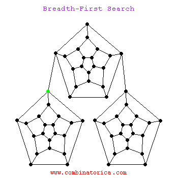

## Graph 


<!-- @import "[TOC]" {cmd="toc" depthFrom=1 depthTo=6 orderedList=false} -->
<!-- code_chunk_output -->

* [Graph](#graph)
	* [Representation of graph](#representation-of-graph)
		* [有向图](#有向图)
			* [拓扑排序](#拓扑排序)
	* [DFS](#dfs)
		* [模版](#模版)
	* [BFS](#bfs)
		* [模板](#模板)
	* [extension](#extension)

<!-- /code_chunk_output -->


### Representation of graph
[representing-graphs](https://www.khanacademy.org/computing/computer-science/algorithms/graph-representation/a/representing-graphs)
* Edge lists
* Adjacency matrices（(i,j)为1表示i与j之间有连接）
* Adjacency lists(i->j,k,l 有三条边由i指向j,k,l)

图一般是带环的，没有环的一般称之为树。图还分为**有向图**和**无向图**。
#### 有向图
* **有向图**的边有方向，若一条边由顶点u指向顶点v，则可以表示(u,v)。
* 有n条边指向顶点v，就可以说顶点v的**indegree**为n。
* 有向图一定有环，但是若几条边的方向首尾相连，那么就会构成一个**圈**。圈上的顶点的indegree都大于0.

##### 拓扑排序
拓扑排序是对有向无圈图的顶点的一种排序，这个排序的结果是如果存在一条vi到vj的路径，那么排序中vi在vj的前面。
```
a） 查找indegree为0的点p
b） 对所有与p邻接的点的indegree = indegree -1；
c） 查找indegree为0的点（p除外），然后循环过程
```
* 207Course Schedule

### DFS
* 一根筋走到底
* 需要用hash表或者stack来保存已经访问过的结点
* [演示过程](http://www.cs.usfca.edu/~galles/visualization/DFS.html)

<!--  -->

#### 模版
```python
def DFS(graph, start):
    # 1.terminator
    if start is None:
        return []
    # 2.init container
    visited = []
    stack = [(start)]

    while stack:
        # 3.pop one node from container
        node  = stack.pop()
        visited.add(node)
        # 4.process current node
        process(node)
        # 5.push releated nodes to container
        nodes = generate_related_nodes(node)
        stack.push(nodes)

    #other processing work
    ...
```
* DFS可以用递归，如果不用递归，则用stack来维护

* 时间复杂度为O(N)，每个结点只访问一次

递归做法
* 200 Number of Islands
* 79 Word Search
* 102 Binary Tree Level Order Traversal


----
### BFS
* [演示过程](http://www.cs.usfca.edu/~galles/visualization/BFS.html)
<!--  -->


#### 模板
```python
def BFS(graph, start):
    # 1.terminator
    if start is None:
        return []
    # 2.init container
    visited = []
    queue.append([start])

    while queue:
        # 3.pop one node from container
        node = queue.pop()
        visited.add(node)
        # 4.process current node
        process(node)
        # 5.push releated nodes to container
        nodes = generate_related_nodes(node)
        queue.push(nodes)

    # other processing work
    ...
```

* BFS不能用递归，因为递归是往下深入一层，与BFS的语义就违背了。所以BFS只能用队列来维护。
* time:O(N)

* 对于树的BFS和DFS，不需要判重，因为树没有环。

* 102 Binary Tree Level Order Traversal
* 103 Binary Tree Zigzag Level Order Traversal  

### extension
DFS用stack
BFS用queue
如果用priority_queue,就是A*算法，启发式搜索