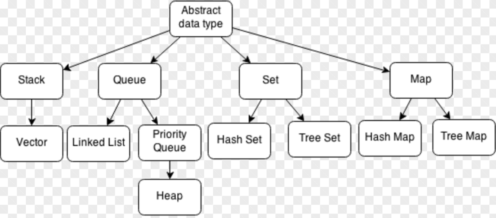

# Basic Data Structure

常用的数据结构一般有数组、单链表、栈、队列、树、哈希表、图等。这是按照数据结构的定义来划分的，一般关于数据结构的书上都是这么划分的。但是实际应用中，例如STL中封装的数据结构种类远不止这么多，而它们的底层实现却无外乎上述几种结构。这里按照STL中的结构将抽象数据结构分为stack、queue、set和map四种结构。

* stack和queue都可以分别基于数组和链表实现。但实际应用中，stack常用于一些特殊模式的存储，和数组一样，按照先后顺序存储元素即可，对数据结构本身并没有太多操作，所以这里将其归为一类。
* linked-list（单链表）在实际应用中主要用于那些插入删除频繁的数据结构，考察点也主要是单链表的基本操作。由于单链表不能随机访问，只能按照插入顺序逐个访问元素，这个过程就类似于队列的特性。而priority-queue作为queue的一种变形，能够按照特定的要求输出元素（按大小顺序等），其内部除了存储元素之外，还要维护一些额外的信息来实现该功能，一般由堆（也即树）来实现。
* set和map常用于查询某个数据是否存在，如果追求查询效率，则用哈希表来存储，查询时间复杂度为O(1)；而用红黑树来存储，查询复杂度为O(log n)，但是内部元素是排好序的，可以整体按序输出。

其实从内存的角度来看，所有的数据结构都可以归为链表，这里的链表并不等同于单链表。数据结构的形式变化再大，在内存中的每个结点无外乎要存储当前节点的值和后续节点的位置指针这两种元素。而每一种数据结构都可以看作是链表的一种特例，数组可以看作是以连续位置代替位置指针；后续指针为一个时就是单链表，为多个时就是树；后续指针又再次指向前序结点时就构成了图；而以数组和单链表为基础又可以根据不同功能来构建栈、队列与哈希表等结构。所以当你能够从一个计算机的角度来看待时，你就能够认识到这些数据结构都是统一的。

## 数组
数组在内存中是一块连续的区域，可以通过下标直接访问对应位置的内存值，查询效率比链表要高；但是插入和删除时（尤其在数组中间操作）需要移动操作位置以后的所有元素，这种操作更适合链表。其实数组也可以看作是链表的一种特例，省去了下一个元素的位置指针，采用默认的方式代替，从而在每个元素区域只保存值就可以。

数组元素的查找优势是按位置查找，但是要按值查找，则要依赖于哈希表和红黑树。

41.first missing positive
* 哈希表查找

solution 1
该题的一般解法是先对数组进行排序，再从正整数部分开始遍历，查找到第一个不连续的值就可以。时间复杂度为O(nlogn)，主要是排序的时间复杂度。

solution 2
第二种方法就根据题目的特性，数组中有n个元素，最理想的情况就是n个元素都是连续正整数，这样输出n，否则的话输出的数会小于n（考虑有负数和大的不连续的数的情况）。所以该方法首先将数组中的元素都存入哈希表，然后遍历数字1~n，查询当前数字是否在哈希表中，如不存在，则输出当前数；若都存在，则输出n。

k sum
* 两边夹逼
时间复杂度最低为O(n^(k-1))
空间复杂度最低为O(1)

solution 1
k层循环逐个数遍历 O(n^k)

solution 2
1.数组元素存入哈希表
2.k-1层遍历，k-1个数加起来作为当前target
3.从哈希表查询target是否存在
time： O(n^(k-1))
space： O(n)

solution3

k>=3时 
1.先sort数组 O(nlogn)
2.k-2层循环枚举，k-2个数加起来作为当前target
3.剩下n-k+1个元素两边夹逼，两个指针首尾遍历O(n)
time： O(n^(k-1))
space： O(1)

20.valid parentheses
* stack应用