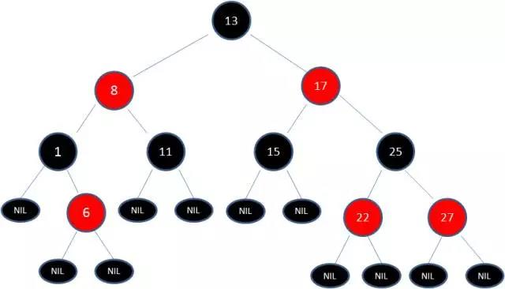
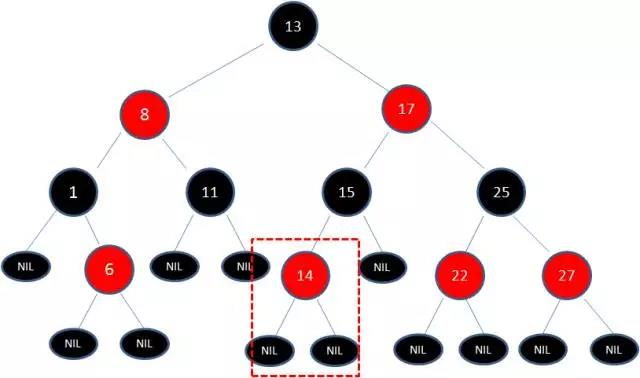
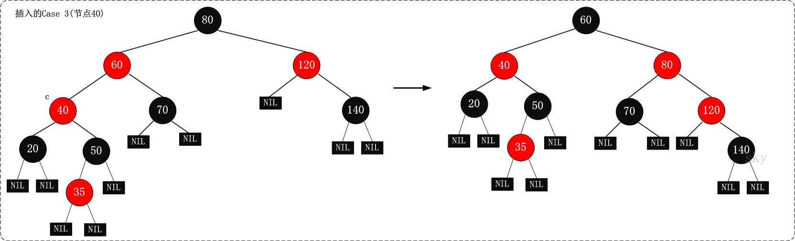
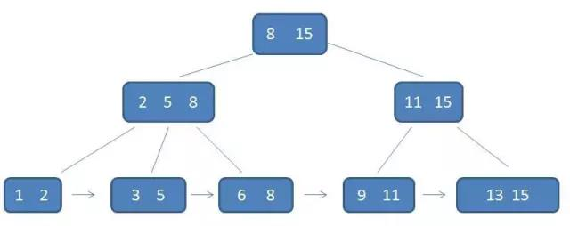
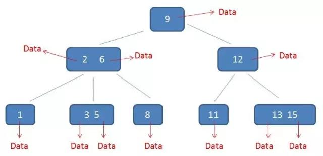
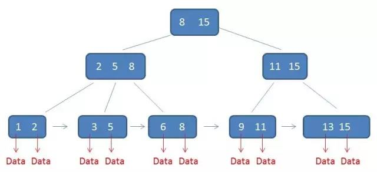

# Tree

- [Tree](#tree)
  - [1. Binary Search Tree](#1-binary-search-tree)
    - [1.1 Basics](#11-basics)
      - [1.1.1 Is BST?](#111-is-bst)
        - [1.1.1.1 recursion](#1111-recursion)
        - [LeetCode](#leetcode)
        - [1.1.1.2 divide and conquer](#1112-divide-and-conquer)
        - [LeetCode](#leetcode-1)
      - [Extensions](#extensions)
      - [1.1.2 BST ←→ Array/Linked list](#112-bst--arraylinked-list)
      - [LeetCode](#leetcode-2)
    - [1.2 Query & Insert & Delete](#12-query--insert--delete)
      - [1.2.1 Query](#121-query)
      - [1.2.2 Insert](#122-insert)
      - [1.2.3 Delete](#123-delete)
    - [1.3 Traversal](#13-traversal)
    - [LeetCode](#leetcode-3)
    - [1.4 Balance](#14-balance)
  - [2. Heap](#2-heap)
    - [2.1 Insert](#21-insert)
      - [★★★](#)
    - [2.2 Delete](#22-delete)
  - [3. Advanced Search Tree](#3-advanced-search-tree)
    - [3.1 RB Tree](#31-rb-tree)
      - [3.1.1 Insert](#311-insert)
        - [Balancing](#balancing)
          - [condition 1](#condition-1)
          - [condition 2](#condition-2)
          - [condition 3](#condition-3)
      - [3.1.2 Delete](#312-delete)
        - [Balancing](#balancing-1)
          - [condition 1](#condition-1-1)
          - [condition 2](#condition-2-1)
          - [condition 3](#condition-3-1)
    - [3.2 AVL Tree](#32-avl-tree)
      - [Advantages](#advantages)
      - [DisAdvantages](#disadvantages)
    - [3.3 SPlay Tree](#33-splay-tree)
      - [Advantages](#advantages-1)
      - [DisAdvantages](#disadvantages-1)
    - [3.4 B- Tree](#34-b--tree)
    - [3.5 B+ Tree](#35-b-tree)
      - [**Differences between B- Tree**](#differences-between-b--tree)
    - [B\* Tree](#b-tree)

## 1. Binary Search Tree

二叉搜索树是一种常用的用来存储和查找数据的树形结构， **它在二维的结构中巧妙地将元素的大小关系也保留下来** 。符合如下特征：
1. 若任意结点的 **左子树** 不空， 则 **左子树** 上所有结点的值均小于它的根结点的值；
2. 若任意结点的 **右子树** 不空， 则 **右子树** 上所有结点的值均大于它的根结点的值；
3. 任意结点的左、 右子树也分别为二叉查找树；
4. 没有键值相等的结点。

特别要注意的是这里判别标准是 **左右子树** 而不是左右结点，并且空树也可以看作是二叉搜索树。二叉查找树相比于其他数据结构的优势在于查找、插入的时间复杂度较低，为O(log n) **这里n为树的高度** 。一些常用的抽象数据结构，例如set、map等，都是基于二叉搜索树实现，并且一些高级的搜索树，例如红黑树，AVL树，其本质都是二叉搜索树。

二叉搜索树的操作主要有以下几种：

-   元素的查找、插入与删除（包括插入与删除后的平衡） 
-   前序、中序与后序遍历
-   广度优先遍历与深度优先遍历

单独考察树的知识时，基本着重于树的种类的判别（是否是BST、平衡树等），上述的几种操作，及其相应概念与方法的一些变体（计算深度、结点等）。而树作为工具使用时，常用于数据的查询，多用set和map。

```cpp
//Definition for a binary tree node.
struct TreeNode {
    int val;
    TreeNode *left;
    TreeNode *right;
    TreeNode(int x) : val(x), left(NULL), right(NULL) {}
};
```

### 1.1 Basics

#### 1.1.1 Is BST?

##### 1.1.1.1 recursion

这一类方法一般用递归的方法根据定义来判断。而递归的实现可以分为三步：
1. recursion terminator
2. current level processing
3. drill down
4. reverse the current level status if needed

按照这个固定的模式可以轻松地写出递归程序，有时其中第二和第三步会混在一起或者交换顺序，待具体情况而定。而第四步也要依据具体情况来看是否需要，比如BFS、DFS中就可能需要。  

##### LeetCode
-   226.Invert Binary Tree 将二叉树镜像翻转

```cpp
    TreeNode *invertTree(TreeNode *root)
    {
        //recursion terminator
        if (root == NULL)
        {
            return NULL;
        }

        //current level processing
        std::swap(root->left, root->right);

        //drill down
        invertTree(root->left);
        invertTree(root->right);

        return root;
    }
```

递归在BST中的其他应用

-   98 Validate Binary Search Tree
-   101 Symmetric Tree
-   104 Maximum Depth of Binary Tree
-   110 Balanced Binary Tree
-   111 Minimum Depth of Binary Tree
-   226 Invert Binary Tree
-   235 Lowest Common Ancestor of a Binary Search Tree
-   236 Lowest Common Ancestor of a Binary Tree  

##### 1.1.1.2 divide and conquer

当然，这类问题也是可以用更一般的分而治之（divide and conquer）法来处理。上述递归法只是分治的一种特例形式，其更一般的形式为：
1. recursion terminator
2. prepare data (将数据分给每一个子问题)
3. conquer subproblems (分给每一个子问题去处理) 
4. process and gererate the final result (将每一个子问题的答案汇总处理，并返回)

对于树的话一般就是分为左子树和右子树去处理。  
**分而治之不一定用于树，也可用于array和list，比如二分法就是类似的分而治之的理念。**  

##### LeetCode

-   111 Minimum Depth of Binary Tree

```cpp
int minDepth(TreeNode *root)
{
    //1.recursion terminator
    if (root == NULL)
    {
        return 0;
    }
    //2.prepare data + 3.conquer subproblems
    int l_depth, r_depth;
    if (!root->left)
    {
        r_depth = minDepth(root->right);
        return 1 + r_depth;
    }
    if (!root->right)
    {
        l_depth = minDepth(root->left);
        return 1 + l_depth;
    }
    l_depth = minDepth(root->left);
    r_depth = minDepth(root->right);
    //4.process and gererate the final result
    return std::min(l_depth, r_depth) + 1;
}
```

#### Extensions

-   完全二叉树与满二叉树  
    完全二叉树指叶结点只能出现在最底部两层，且最底部叶结点均处于次底层叶结点的左侧。  
    完全二叉树指所有叶结点都处于最底层。

#### 1.1.2 BST ←→ Array/Linked list

有序数组、链表转为BST，其一般方法和过程如下图所示，不断的寻找中点，作为当前子树的root结点，然后递归下去。对于链表，可以用快慢指针来寻找中点。
另一种方法是采用中序遍历的方法，因为BST的中序遍历结果就是有序的数组或者链表，而将有序数组、链表转为BST，则是其逆命题。

  


而将BST转为有序数组，如上所述，采用中序遍历的方法就可以实现目标。

 
BST/bst2array.gif  

#### LeetCode
-   109 Convert Sorted List to Binary Search Tree
-   114 Flatten Binary Tree to Linked List   

### 1.2 Query & Insert & Delete

#### 1.2.1 Query

在二叉搜索树b中查找某个元素x的过程为：

-   若b是空树，则搜索失败，否则：
-   若x等于b的根结点的数据域之值，则查找成功；否则：
-   若x小于b的根结点的数据域之值，则搜索左子树；否则：
-   查找右子树。


二叉搜索树的查找过程十分类似于二分查找法，但其优势是二叉搜索树按照中序遍历可以直接输出有序的元素。

#### 1.2.2 Insert

二叉搜索树的插入与删除都是基于查找来实现的，超找到对应的位置，再进行操作。以向二叉搜索树b中插入结点s为例，其过程为

-   若b是空树，则将s所指结点作为根结点插入，否则：
-   若s->data等于b的根结点的数据域之值，则返回，否则：
-   若s->data小于b的根结点的数据域之值，则把s所指结点插入到左子树中，否则：
-   把s所指结点插入到右子树中。（新插入结点总是叶子结点）


二叉搜索树的查找复杂度是与树的高度成比例，但是其在插入或者删除的过程中，可能退化为一个单链表，这时候的查找效率就会大打折扣。所以平衡的作用就是通过变换树的结点的位置，来让所有结点在根结点的两边平均分布，以降低树的高度，达到提高查找效率的目的。

#### 1.2.3 Delete

删除过程首先也是找到要删除的结点，然后根据其子结点的情况，具体分为以下几种情况  
1. **被删除结点没有儿子，即为叶结点。那么，直接将该结点删除就OK了。**  
2. **被删除结点只有一个儿子。那么，直接删除该结点，并用该结点的唯一子结点顶替它的位置。**  
3. **被删除结点有两个儿子。那么，先找出它的后继结点；然后把“它的后继结点的内容”复制给“该结点的内容”；之后，删除“它的后继结点”。**  

在这里，后继结点相当于替身，在将后继结点的内容复制给"被删除结点"之后，再将后继结点删除。这样就巧妙的将问题转换为"删除后继结点"的情况了，下面就考虑后继结点。 
由于是二叉搜索树，所以后继结点是指右子树中最小的结点，也就是大于要删除结点的第一个结点。而该后继结点如果还存在左孩子，那么左孩子一定比该结点小，那么后继结点就不成立。**所以找到的后继结点，其左子树一定为空**，如果右子树也为空，那么就是情况1；如果右子树不为空，那么就是情况2，再作相应处理即可。

### 1.3 Traversal

二叉搜索树的三种[遍历方法](https://www.tutorialspoint.com/data_structures_algorithms/tree_traversal.htm)实现形式非常类似，只是处理当前阶段的顺序在前、中、后的差别。具体形式如下：

```cpp
PreOrder(TreeNode *root){
    if(root){
        traverse_path(root);
        PreOrder(root->left);
        PreOrder(root->right);
    }
}

InOrder(TreeNode *root){
    if(root){
        InOrder(root->left);
        traverse_path(root);
        InOrder(root->right);
    }
}

PostOrder(TreeNode *root){
    if(root){
        PostOrder(root->left);
        PostOrder(root->right);
        traverse_path(root);
    }
}
```

对于三种遍历方法的实现，这里都可以用递归的方法来实现，而且推荐使用递归的形式来实现。为什么呢？很多人和教材以及网上的资料会告诉你递归要不断进行上下文切换与堆栈的调用，效率低下。但是实际情况中，未必是这样。用STL的栈和队列结构来手动实现递归同样也有会引入很多其他的开销，例如额外变量的创建、拷贝等。而且很多时候STL的操作代码看似很简洁，但是内部却做了很多的事，并且很多人对这些内部处理的开销知之甚少。同时不同应用场景下，影响一个程序效率的因素太多，太多是我们无法掌控的，既然无法掌控，就不能妄加评论说是效率低。

但是我可以肯定的是，大部分情况下，手动实现递归的代码可读性会比递归实现的代码差，这就给维护人员造成很大麻烦，甚至几个月后自己看都看不懂。要记住代码是写给人看的，给计算机运行只是一个额外的功能。你的代码只要能跑起来或者编译通过，那就说明计算机能够理解，这并不难，但要让别人也能一下看懂你的代码，这就很难了。在现在互联网应用的快读开发中，你的代码不可能写完后就永远不改了，实际情况是要经常改动，甚至要由别人来维护。如果你的代码写的简单、清晰明了，让人能很快理解，这让才便于维护，也能更好地重构。从产品角度来讲，这是降低了人月成本，也是提高了效率。

那么BST的递归操作时间复杂度是多少呢？这里的一个方法就是看每个结点访问了几次，这三种遍历方法对每个结点来说都只访问一次，所以时间复杂度都是O(N)，这里N是BST结点的数目。很多递归算法在每一层展开计算时，会有很多重复计算的结点，所以造成时间复杂度呈现指数。最典型的就是裴波那契问题，但是BST的递归每一层其实都是按照树的结构展开的，而BST中的结点又是不交叉重复的，所以不用担心时间复杂度指数增长。

从以上几点来讲，实际开发中，涉及到BST的一些操作，用递归来实现完全就可以。一般来说性能的瓶颈并不在这（这里特指BST的递归）。这里的应用场景是指需要通过裸操作来实现对数据的处理，所以数据量不会很大。对于复杂的或是海量数据，那就建议用专门的框架、库来操作，而且这些库一般都会提供封装好的接口来操作。

### LeetCode

preorder

-   114 Flatten Binary Tree to Linked List

inorder

-   99 Recover Binary Search Tree
-   230 Kth Smallest Element in a BST

### 1.4 Balance

二叉搜索树的查找效率与树高成比例，而平衡操作正是通过一系列的操作尽可能地降低树的高度。若二叉搜索树的高度正好是logn向下取整，则称为**理想平衡**。
而若将标准放宽，比如将树高限制为“渐进地不超过O(log n)”,则称为**适度平衡**。AVL、RB Tree、伸展树都属于适度平衡。

* * *

## 2. Heap

这里的堆并不是指内存中的堆栈，而是指大顶堆与小顶堆这样的结构，其本质上也是一颗 **二叉平衡树**。其顶点值为树中的最大值或者最小值。但是值得注意的是，**堆除了顶点为最大值之外，内部子树并不能保证像二叉搜索树那样有序，但是每棵子树的顶点都是该子树的最大值**。  

堆是一个`完全二叉树`的结构。

### 2.1 Insert

堆在插入新元素时总是在堆的**末尾**插入。那么堆的末尾是什么位置？就是按从左到右依次在各叶子结点后插入，这样能保证左右子树的高度最多相差1（平衡）。之后还需要调整各个结点的值，以使整个树达到平衡。

以大顶堆为例

1. 比较新结点与父结点的值，如果大于父结点的值，则与父结点交换（交换两个结点的值）。
2. 若小于等于父结点的值，则停止。
3. 再次比较交换后的结点与其父结点的值，重复1、2的过程，直到当前结点小于等于父结点的值。


**单次插入的时间复杂度为O(logn)，但是建堆时所有元素插入后调整的复杂度为O(n)**

#### ★★★
* 堆的插入过程，总是按照完全二叉树的位置在末尾插入元素，然后依次向上**上浮**，直到调整到合适的位置。  
* 而删除的过程，则是将堆顶和堆尾互换，然后堆顶元素**下滤**。  
* 但是建堆的过程则不一样，可以是直接一个个元素插入，但是一般按照floyd算法来建堆。所有数据按照完全二叉树的位置插入，然后从len/2到0来调整堆，相当于每次把元素插入堆顶，然后**下滤**，`这样就可以和删除过程用同样的堆调整算法`。

### 2.2 Delete

**堆只能删除堆顶元素，而不能直接删除中间的某个元素。** 删除堆顶元素后，要对堆进行重新调整，使得堆顶仍为最大值或者最小值。

以大顶堆为例

1.  将堆尾结点移到堆顶。
2.  比较堆顶结点和它的左右子结点。
3.  如果堆顶元素小于某个子结点，那么和**值较大的结点**进行交换。**即：parent和两个child求一个最大值，然后换到parent上面去！**（如果是小顶堆，那么就是  堆顶元素大于某个子节点，那就和值较小的结点进行交换）
4.  如果堆顶元素大于两个子结点，那么停止。
5.  交换后的子树重复2~4的过程，直到停止或者自身变为叶子结点。

  

**单次删除的时间复杂度为O(logn)，整体复杂度为O(nlogn)**

* * *

## 3. Advanced Search Tree

### 3.1 RB Tree

**红黑树的本质是BST**，但是通过定义一系列的特性以及平衡操作，**使整个树的高度降低**，这样查找效率就能提高！红黑树具有如下的一些特征：

1.  结点是红色或黑色。
2.  根结点是黑色。
3.  每个叶子结点都是黑色的空结点（NIL结点）。
4.  每个红色结点的两个子结点都是黑色。(从每个叶子到根的所有路径上不能有两个连续的红色结点)
5.  从任一结点到其每个叶子的所有路径都包含相同数目的黑色结点。(红黑树从任一结点到叶子结点的最长路径不会超过最短路径的两倍。)  
      
      

红黑树的应用比较广泛，主要是用它来存储有序的数据，它的时间复杂度是O(lgn)，效率非常之高。
例如，Java集合中的TreeSet和TreeMap，C++ STL中的set、map，以及Linux虚拟内存的管理，都是通过红黑树去实现的。  

-   **适度平衡**  
    **红黑树只能说是“近似”平衡二叉树**，平衡的定义是两棵子树的高度差小于等于1，而红黑树是不会相差两倍以上（见特性5）。从高度差上来说，红黑树略大，可以证明[红黑树的最大深度为2log(n+1)](http://www.cnblogs.com/skywang12345/p/3245399.html)，查询时间复杂度也是O(log n)。但是**插入和删除操作，红黑树的平均时间短（重平衡过程中，仅涉及常数个结点的调整）**，而且保存红黑树的状态，只需要一个bit。

#### 3.1.1 Insert

```cpp
RB-INSERT(T, z) 

// step 1
 y ← nil[T]                        // 新建结点“y”，将y设为空结点。
 x ← root[T]                       // 设“红黑树T”的根结点为“x”
 while x ≠ nil[T]                  // 找出要插入的结点“z”在二叉树T中的位置“y”
     do y ← x                      
        if key[z] < key[x]  
           then x ← left[x]  
           else x ← right[x]  
 p[z] ← y                          // 设置 “z的父亲” 为 “y”
 if y = nil[T]                     
    then root[T] ← z               // 情况1：若y是空结点，则将z设为根
    else if key[z] < key[y]        
            then left[y] ← z       // 情况2：若“z所包含的值” < “y所包含的值”，则将z设为“y的左孩子”
            else right[y] ← z      // 情况3：(“z所包含的值” >= “y所包含的值”)将z设为“y的右孩子” 

// step 2
 left[z] ← nil[T]                  // z的左孩子设为空
 right[z] ← nil[T]                 // z的右孩子设为空。至此，已经完成将“结点z插入到二叉树”中了。
 color[z] ← RED                    // 将z着色为“红色”

// step 3
 RB-INSERT-FIXUP(T, z)             // 通过RB-INSERT-FIXUP对红黑树的结点进行颜色修改以及旋转，让树T仍然是一颗红黑树
```

红黑树的插入操作分为三个步骤：

-   第一步和BST的操作一样。 
-   第二步将新插入的结点的叶子结点设为空，并将该结点设置为红色。  
    （为什么要设为红色呢？因为这样不会违背"特性(5)"！少违背一条特性，就意味着我们需要处理的情况越少）  
-   第三步就是调用RB-INSERT-FIXUP来对结点进行重新着色，并旋转，使之重新满足红黑树的特性。

##### Balancing

红黑树在插入或者删除结点时如果破坏了规则，那么就必须重新调整，以符合红黑树的规则。调整的方法有变色和旋转两种。

-   **tree rotation**
    以Q为支点进行右旋和以P为支点进行左旋。
    

###### condition 1

如果原树是空树，那么插入的结点就是根结点，因此直接将此结点涂为黑色即可。

###### condition 2

如果插入结点的父结点是是黑色，那么什么也不用做，并没有破坏红黑树的规则（如下图）。


###### condition 3

被插入的结点的父结点是红色。该情况与红黑树的“特性(5)”相冲突。这种情况下，被插入结点是一定存在非空祖父结点的；进一步的讲，被插入结点也一定存在叔叔结点(即使叔叔结点为空，我们也视之为存在，空结点本身就是黑色结点)。理解这点之后，我们依据"叔叔结点的情况"，将这种情况进一步划分为3种情况(Case)。

```cpp
RB-INSERT-FIXUP(T, z)
while color[p[z]] = RED                                                  // 若“当前结点(z)的父结点是红色”，则进行以下处理。
    do if p[z] = left[p[p[z]]]                                           // 若“z的父结点”是“z的祖父结点的左孩子”，则进行以下处理。
          then y ← right[p[p[z]]]                                        // 将y设置为“z的叔叔结点(z的祖父结点的右孩子)”
               if color[y] = RED                                         // Case 1条件：叔叔是红色
                  then color[p[z]] ← BLACK                    ▹ Case 1   //  (01) 将“父结点”设为黑色。
                       color[y] ← BLACK                       ▹ Case 1   //  (02) 将“叔叔结点”设为黑色。
                       color[p[p[z]]] ← RED                   ▹ Case 1   //  (03) 将“祖父结点”设为“红色”。
                       z ← p[p[z]]                            ▹ Case 1   //  (04) 将“祖父结点”设为“当前结点”(红色结点)
                  else if z = right[p[z]]                                // Case 2条件：叔叔是黑色，且当前结点是右孩子
                          then z ← p[z]                       ▹ Case 2   //  (01) 将“父结点”作为“新的当前结点”。
                               LEFT-ROTATE(T, z)              ▹ Case 2   //  (02) 以“新的当前结点”为支点进行左旋。
                          color[p[z]] ← BLACK                 ▹ Case 3   // Case 3条件：叔叔是黑色，且当前结点是左孩子。(01) 将“父结点”设为“黑色”。
                          color[p[p[z]]] ← RED                ▹ Case 3   //  (02) 将“祖父结点”设为“红色”。
                          RIGHT-ROTATE(T, p[p[z]])            ▹ Case 3   //  (03) 以“祖父结点”为支点进行右旋。
       else (same as then clause with "right" and "left" exchanged)      // 若“z的父结点”是“z的祖父结点的右孩子”，将上面的操作中“right”和“left”交换位置，然后依次执行。
color[root[T]] ← BLACK
```

|       | 现象说明                                                                         | 处理策略                                                                                                                                                                                   |
| ----- | -------------------------------------------------------------------------------- | ------------------------------------------------------------------------------------------------------------------------------------------------------------------------------------------ |
| Case1 | 当前结点的父结点是红色，且当前结点的祖父结点的另一个子结点（叔叔结点）也是红色。 | (01) 将“父结点”设为黑色。 <br> (02) 将“叔叔结点”设为黑色。<br>(03) 将“祖父结点”设为“红色”。<br>(04) 将“祖父结点”设为“当前结点”(红色结点)；即，之后继续对“当前结点”进行操作。 |
| Case2 | 当前结点的父结点是红色，叔叔结点是黑色，且当前结点是其父结点的右孩子             | (01) 将“父结点”作为“新的当前结点”。<br>(02) 以“新的当前结点”为支点进行左旋。之后继续对之前设定的“当前结点”进行操作。                                                               |
| Case3 | 当前结点的父结点是红色，叔叔结点是黑色，且当前结点是其父结点的左孩子             | (01) 将“父结点”设为“黑色”。<br>(02) 将“祖父结点”设为“红色”。<br>(03) 以“祖父结点”为支点进行右旋。                                                                                |


上面三种情况(Case)处理问题的核心思路都是：**将红色的结点移到根结点；然后，将根结点设为黑色。**

1.  **(Case 1)叔叔是红色**  
    Case 1主要是变色操作，变色操作后，**如果祖父结点是根结点，那么直接将根结点涂为黑色即可！** 否则将祖父结点作为当前结点进行新一轮的操作。在新一轮的操作用可能会转到Case 2和3。
    如下图经过Case1调整后，结点60变为当前结点。
    
2.  **(Case 2)叔叔是黑色，且当前结点是右孩子**  
    
    如上图，经过case调整后结点60为当前结点，然后按照Case2，**将40设为当前结点**进行左旋。注意左旋完成后结点40依然是当前结点。
3.  **(Case 3)叔叔是黑色，且当前结点是左孩子**  
    经过Case2调整后，当前结点40满足了Case3的条件，进行Case 3处理之后，再将结点"120"当作当前结点，就变成了Case 2的情况。
    

#### 3.1.2 Delete

将红黑树内的某一个结点删除。需要执行的操作依次是：

-   首先，将红黑树当作一颗二叉查找树，将该结点从二叉查找树中删除；(这里的“后继结点”是指非空结点,而且交换时，只把值交换，而不把结点颜色交换)
-   然后，通过"旋转和重新着色"等一系列来修正该树，使之重新成为一棵红黑树。

```cpp
RB-DELETE(T, z)
// 1.将待删除的结点赋给y（可能直接就是z，也可能是z的后继结点）
if left[z] = nil[T] or right[z] = nil[T]         
   then y ← z                                  // 若“z的左孩子” 或 “z的右孩子”为空，则将“z”赋值给 “y”；
   else y ← TREE-SUCCESSOR(z)                  // 否则，将“z的后继结点”赋值给 “y”。
// 2.将y的后续结点赋给x
if left[y] ≠ nil[T]
   then x ← left[y]                            // 若“y的左孩子” 不为空，则将“y的左孩子” 赋值给 “x”；
   else x ← right[y]                           // 否则，“y的右孩子” 赋值给 “x”。
// 3.移除结点y
p[x] ← p[y]                                    // 将“y的父结点” 设置为 “x的父结点”
if p[y] = nil[T]                               
   then root[T] ← x                            // 情况1：若“y的父结点” 为空，则设置“x” 为 “根结点”。
   else if y = left[p[y]]                    
           then left[p[y]] ← x                 // 情况2：若“y是它父结点的左孩子”，则设置“x” 为 “y的父结点的左孩子”
           else right[p[y]] ← x                // 情况3：若“y是它父结点的右孩子”，则设置“x” 为 “y的父结点的右孩子”
// 4.如果删除的是z的后继，那么应该将z和后继结点的值相交换先
if y ≠ z                                    
   then key[z] ← key[y]                        // 若“y的值” 赋值给 “z”。！！！注意：这里只拷贝z的值给y，而没有拷贝z的颜色！！！
        copy y's satellite data into z  
// 5.删除的结点是黑结点，才进行调整       
if color[y] = BLACK                            
   then RB-DELETE-FIXUP(T, x)                  // 若“y为黑结点”，则调用
return y
```

从代码中可以看出，**如果删除的结点原来是红色的，那么什么都不用做**。如果删除的结点是黑色的，那么就需要进行重新调整已是红黑树重新“平衡”。 

##### Balancing

**我们从删除结点的后继结点开始调整**，也就是从结点x开始调整。由于这里的情况是y一定是黑色的，所以这里假定x继承了这一黑色，有双重颜色属性。RB-DELETE-FIXUP的思想是：将x所包含的额外的黑色不断沿树上移(向根方向移动)，直到出现下面的几种情况：   

###### condition 1

情况说明：x是“红+黑”结点。  
处理方法：直接把x设为黑色，结束。此时红黑树性质全部恢复。

###### condition 2

情况说明：x是“黑+黑”结点，且x是根。  
处理方法：什么都不做，结束。此时红黑树性质全部恢复。

###### condition 3

情况说明：x是“黑+黑”结点，且x不是根。  
处理方法：这种情况又可以划分为4种子情况。

```cpp
RB-DELETE-FIXUP(T, x)
while x ≠ root[T] and color[x] = BLACK  
    do if x = left[p[x]]      
          then w ← right[p[x]]                                             // 若 “x”是“它父结点的左孩子”，则设置 “w”为“x的叔叔”(即x为它父结点的右孩子)                                          
               if color[w] = RED                                           // Case 1: x是“黑+黑”结点，x的兄弟结点是红色。(此时x的父结点和x的兄弟结点的子结点都是黑结点)。
                  then color[w] ← BLACK                        ▹  Case 1   //   (01) 将x的兄弟结点设为“黑色”。
                       color[p[x]] ← RED                       ▹  Case 1   //   (02) 将x的父结点设为“红色”。
                       LEFT-ROTATE(T, p[x])                    ▹  Case 1   //   (03) 对x的父结点进行左旋。
                       w ← right[p[x]]                         ▹  Case 1   //   (04) 左旋后，重新设置x的兄弟结点。
               if color[left[w]] = BLACK and color[right[w]] = BLACK       // Case 2: x是“黑+黑”结点，x的兄弟结点是黑色，x的兄弟结点的两个孩子都是黑色。
                  then color[w] ← RED                          ▹  Case 2   //   (01) 将x的兄弟结点设为“红色”。
                       x ←  p[x]                               ▹  Case 2   //   (02) 设置“x的父结点”为“新的x结点”。
                  else if color[right[w]] = BLACK                          // Case 3: x是“黑+黑”结点，x的兄弟结点是黑色；x的兄弟结点的左孩子是红色，右孩子是黑色的。
                          then color[left[w]] ← BLACK          ▹  Case 3   //   (01) 将x兄弟结点的左孩子设为“黑色”。
                               color[w] ← RED                  ▹  Case 3   //   (02) 将x兄弟结点设为“红色”。
                               RIGHT-ROTATE(T, w)              ▹  Case 3   //   (03) 对x的兄弟结点进行右旋。
                               w ← right[p[x]]                 ▹  Case 3   //   (04) 右旋后，重新设置x的兄弟结点。
                        color[w] ← color[p[x]]                 ▹  Case 4   // Case 4: x是“黑+黑”结点，x的兄弟结点是黑色；x的兄弟结点的右孩子是红色的。(01) 将x父结点颜色 赋值给 x的兄弟结点。
                        color[p[x]] ← BLACK                    ▹  Case 4   //   (02) 将x父结点设为“黑色”。
                        color[right[w]] ← BLACK                ▹  Case 4   //   (03) 将x兄弟结点的右子节设为“黑色”。
                        LEFT-ROTATE(T, p[x])                   ▹  Case 4   //   (04) 对x的父结点进行左旋。
                        x ← root[T]                            ▹  Case 4   //   (05) 设置“x”为“根结点”。
       else (same as then clause with "right" and "left" exchanged)        // 若 “x”是“它父结点的右孩子”，将上面的操作中“right”和“left”交换位置，然后依次执行。
color[x] ← BLACK
```

|       | 现象说明                                                                      | 处理策略                                                                                                                                                                        |
| ----- | ----------------------------------------------------------------------------- | ------------------------------------------------------------------------------------------------------------------------------------------------------------------------------- |
| Case1 | x的兄弟结点是红色。(此时x的父结点和x的兄弟结点的子结点都是黑结点)。           | (01) 将x的兄弟结点设为“黑色”。<br>(02) 将x的父结点设为“红色”。<br>(03) 对x的父结点进行左旋。<br>(04) 左旋后，重新设置x的兄弟结点。**结点x不变，只是重新设置了新的兄弟结点** |
| Case2 | x的兄弟结点是黑色，x的兄弟结点的两个孩子都是黑色。                            | (01) 将x的兄弟结点设为“红色”。<br>(02) 设置“x的父结点”为“新的x结点”。                                                                                                     |
| Case3 | x的兄弟结点是黑色；x的兄弟结点的左孩子是红色，右孩子是黑色的。                | (01) 将x兄弟结点的左孩子设为“黑色”。<br>(02) 将x兄弟结点设为“红色”。<br>(03) 对x的兄弟结点进行右旋。<br>(04) 右旋后，重新设置x的兄弟结点。                                  |
| Case4 | x的兄弟结点是黑色；x的兄弟结点的右孩子是红色的，x的兄弟结点的左孩子任意颜色。 | (01) 将x父结点颜色 赋值给 x的兄弟结点。<br>(02) 将x父结点设为“黑色”。<br>(03) 将x兄弟结点的右子节设为“黑色”。<br>(04) 对x的父结点进行左旋。<br>(05) 设置“x”为“根结点”。 |

1.  **(Case 1)x的兄弟结点是红色，x的父结点和x的兄弟结点的子结点都是黑结点**  
    **这样做的目的是将“Case 1”转换为“Case 2”、“Case 3”或“Case 4”，从而进行进一步的处理。**
    
    图中的B和D颜色要互换

2.  **x的兄弟结点是黑色，x的兄弟结点的两个孩子都是黑色**  
    **把当前结点和兄弟结点中抽取一重黑色追加到父结点上，把父结点当成新的当前结点，重新进入算法。**
    
    例子中，父结点B为红色，但其实也可以为黑色。  
    **把结点x的第二重黑色追加到父结点之后**，所有经过x的分支中黑结点个数没变化；但是，**所有经过x的兄弟结点的分支中黑色结点的个数增加了1(因为x的父结点多了一个黑色属性)**！为了解决这个问题，我们需要将“所有经过x的兄弟结点的分支中黑色结点的个数减1”即可，那么就可以通过“将x的兄弟结点由黑色变成红色”来实现。

3.  **x的兄弟结点是黑色；x的兄弟结点的左孩子是红色，右孩子是黑色的**  
    **处理“Case 3”的目的是为了将“Case 3”进行转换，转换成“Case 4”,从而进行进一步的处理。**
    

4.  **x的兄弟结点是黑色；x的兄弟结点的右孩子是红色的，x的兄弟结点的左孩子任意颜色**  
    **处理“Case 4”的目的是：去掉x中额外的黑色，将x变成单独的黑色。**
    

经过，上面的处理之后。红黑树的特性全部得到的满足！接着，我们将x设为根结点，就可以跳出while循环(参考伪代码)；即完成了全部处理。  
伪代码中是以“x”是左孩子的情况来说明的；若 “x”是“它父结点的右孩子”，将上面的操作中“right”和“left”交换位置，然后依次执行。

References  
[红黑树(一)之 原理和算法详细介绍](http://www.cnblogs.com/skywang12345/p/3245399.html#a3)  
[教你透彻了解红黑树](http://blog.csdn.net/v_JULY_v/article/details/6105630)

* * *

### 3.2 AVL Tree

AVL = G. M. Adelson‐Velsky & E. M. Landis (1962)  
AVL树是最早实现的平衡BST  

#### Advantages

-   O(logn) 的查找速度、插入和删除效率
-   O(n) 的存储空间
-   符合 Dictionary / Map 的 ADT
-   特别适合于需要频繁大范围查找的动态数据  


#### DisAdvantages
-   实测统计的复杂度不低
-   插入/删除后，需要旋转
-   删除操作后的平衡化，最坏情况下需要旋转 O(logn) 次
-   若需频繁进行插入/删除操作，不免得不偿失
-   需要设置附加域记录高度或平衡因子（实现复杂）

### 3.3 SPlay Tree

AVL树的局限性：刚被访问过的数据，极有可能再次被访问。  
优化策略：每一节点被访问后，都调整至root。

#### Advantages

-   分摊复杂度 O(logn) —— 与 AVL 树相当 //局部性强时甚至更低
-   无需记录节点高度或平衡因子 //优于 AVL 树
-   编程实现简单易行 //优于 AVL 树
-   persistent structures vs. ephemeral structures  


#### DisAdvantages
-   不能保证单次最坏情况的出现 //不适用于对效率敏感的场合
-   复杂度的分析稍嫌复杂 //不如 AVL 树——但好在有初等的解释

### 3.4 B- Tree

从算法逻辑上来讲，BST的查找速度和比较次数都是最小的，但是数据库的瓶颈在于**磁盘IO**。  
数据库的索引存在磁盘上，可能有几个G，不可能全部读入内存。而且一次IO读取1个字节和1KB效率是一样的。与其一个结点一个结点的读入内存比较，不如一次读取多个结点进行比较。所以相比于普通BST，B-树每个结点有多个结点，这样树更矮，查询次数更少。  
**[B-树](https://mp.weixin.qq.com/s/ecaSI1ScMpYFkprw-2KdUA)是一种多路查找平衡树，每个结点最多包含m个孩子，称为m阶。** 具有如下特征：  

1.  根结点至少有两个子女。  
2.  每个中间节点都包含k-1个元素和k个孩子，其中 m/2 &lt;= k &lt;= m  
3.  每一个叶子节点都包含k-1个元素，其中 m/2 &lt;= k &lt;= m  
4.  所有的叶子结点都位于同一层。  
5.  每个节点中的元素从小到大排列，节点当中k-1个元素正好是k个孩子包含的元素的值域分划。


-   B-树查询时，先从磁盘读取一整块数据到内存，再进行比较。相比于磁盘IO，内存中的比较操作完全可以忽略。
-   B-树主要用于文件系统以及部分数据库索引，（比如MongoDB）
-   而大部分关系型数据库的索引主要用hash表或者B+树  

### 3.5 B+ Tree

[B+树](https://mp.weixin.qq.com/s/qP_qxJDV3R2QefnztgN2Tg)是B-树的变体，有着比B-树更高的查询性能。

一个m阶的B+树具有如下几个特征：
1\. 有k个子树的中间节点包含有k个元素（B树中是k-1个元素），每个元素不保存数据，只用来索引，所有数据都保存在叶子节点。
2\. 所有的叶子结点中包含了全部元素的信息，及指向含这些元素记录的指针，且叶子结点本身依关键字的大小自小而大顺序链接。
3\. **所有的中间节点元素都同时存在于子节点**，在子节点元素中是最大（或最小）元素。

  
根节点的最大元素是整个B+树的最大元素，无论插入删除多少元素，始终要保持最大元素在根节点中。  

#### **Differences between B- Tree**

1.  范围查询方便  
    **叶子节点包含了所有元素信息**，而且每个叶子节点带有指针指向下一个元素，**形成一个有序链表**。B-树范围查询只能靠中序遍历，B+树只需要在最终链表上遍历就可以。  
2.  IO次数更少  
    B-树中，所有节点都带有“卫星数据”。  
      
    B+树中，只有叶子节点带有“卫星数据”，中间节点仅仅是索引，没有任何数据关联。  
      
    在数据库的聚集索引（Clustered Index）中，叶子节点直接包含卫星数据。在非聚集索引（NonClustered Index）中，叶子节点带有指向卫星数据的指针。
    **B+树中间节点没有卫星数据，所以同样大小的磁盘页可以容纳更多的节点元素。** B+树更矮胖，查询的IO次数也越少。  
3.  查询性能稳定  
    B+树的查询必须查询到叶子节点，每次查找都是稳定的。而B-树只要查找到某一结点就可以结束，查找性能并不稳定。

mysql 用B+Tree，联合索引如何存储？

### B\* Tree

是B+树的变体，在B+树的非根和非叶子结点再增加指向兄弟的指针；  
B_树定义了非叶子结点关键字个数至少为(2/3)_M，即块的最低使用率为2/3（代替B+树的1/2）；  

       B+树的分裂：

当一个结点满时，分配一个新的结点，并将原结点中1/2的数据复制到新结点，最后在父结点中增加新结点的指针；B+树的分裂只影响原结点和父结点，而不会影响兄弟结点，所以它不需要指向兄弟的指针；

       B*树的分裂：

当一个结点满时，如果它的下一个兄弟结点未满，那么将一部分数据移到兄弟结点中，再在原结点插入关键字，最后修改父结点中兄弟结点的关键字（因为兄弟结点的关键字范围改变了）；如果兄弟也满了，则在原结点与兄弟结点之间增加新结点，并各复制1/3的数据到新结点，最后在父结点增加新结点的指针；

       所以，B*树分配新结点的概率比B+树要低，空间使用率更高；
